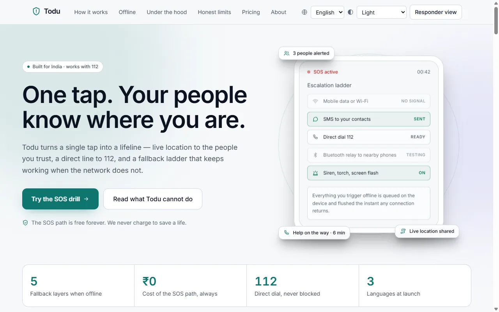
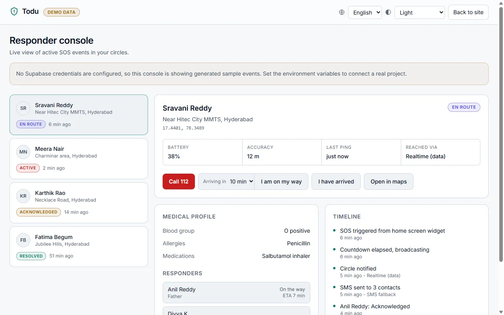
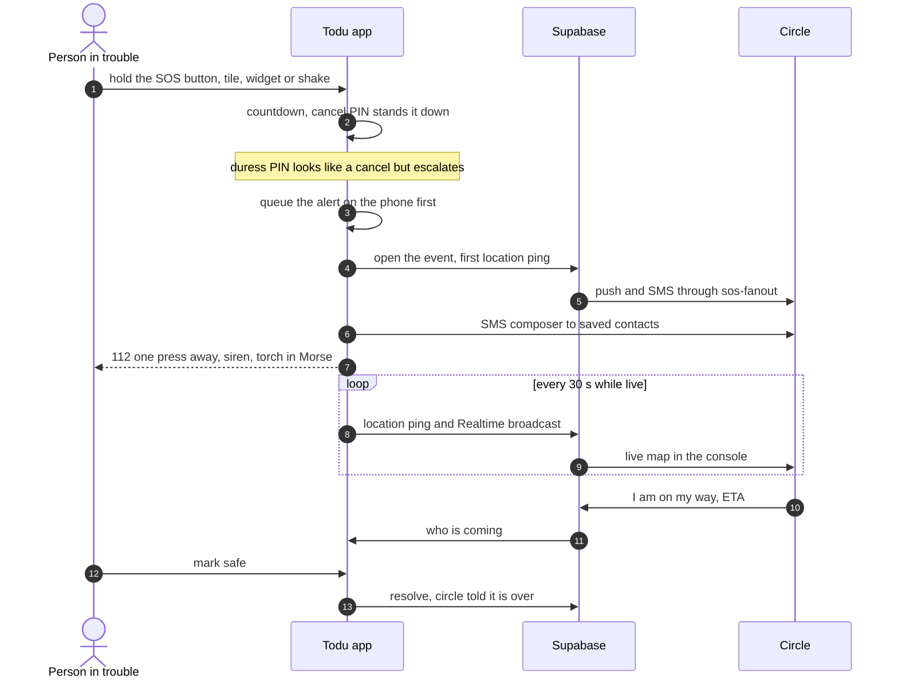
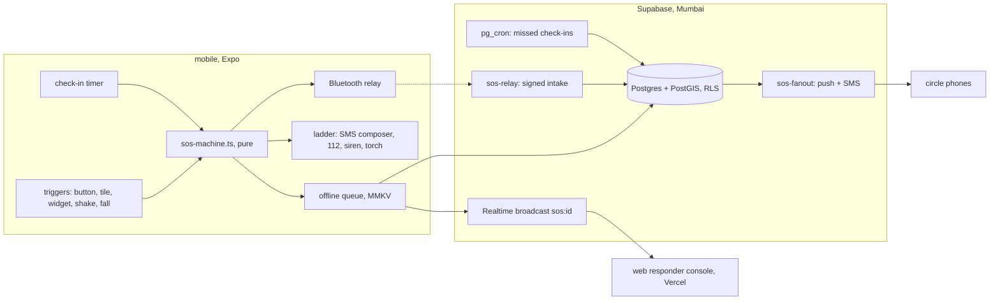

<p align="center">
  <a href="https://todu-kandula.vercel.app">
    
  </a>
</p>

<p align="center">
  <a href="https://github.com/kandulanikhilvarma/to-du/actions/workflows/ci.yml"></a>
  <a href="LICENSE"></a>
  <a href="https://todu-kandula.vercel.app"></a>
  
  
</p>

<p align="center">
  <a href="https://todu-kandula.vercel.app"><b>Live site</b></a> ·
  <a href="https://todu-kandula.vercel.app/dashboard"><b>Responder console</b></a> ·
  <a href="docs/ARCHITECTURE.md"><b>Architecture</b></a> ·
  <a href="#known-gaps"><b>Known gaps</b></a> ·
  <a href="https://todu-kandula.vercel.app/about"><b>About the maker</b></a>
</p>

**Todu is a personal emergency SOS app for India**, with a companion website and
a responder console. One tap starts a short countdown; if nobody cancels it,
your circle gets your live location, 112 is one press away, and a fallback
ladder keeps trying when the network does not.

> [!IMPORTANT]
> Todu is not a substitute for emergency services. In an emergency, call **112**.
> Offline features are best effort and depend on your device, your network and
> nearby users.

<table>
  <tr>
    <td width="50%"></td>
    <td width="50%"></td>
  </tr>
  <tr>
    <td align="center"><sub>The website, light by default, in English, Telugu and Hindi</sub></td>
    <td align="center"><sub>The responder console, here on labelled demo data</sub></td>
  </tr>
</table>

## How one alert travels



No signal at step 5? The alert waits in the on-device queue and goes the
moment any connection returns. With a Bridgefy licence, it also hops to a
nearby Todu phone over Bluetooth, signed so the relay can carry it but never
forge it.

## The fallback ladder

| Rung | What it does | Proof it reports |
|---|---|---|
| Mobile data or Wi-Fi | Opens the event on Supabase, streams location | Delivered only when the server accepts it |
| SMS to your contacts | Opens a pre-filled SMS composer | "Sent" only if Android says sent; stores allow no silent SMS |
| Direct dial 112 | One large button on the live screen | Ready; the call itself is yours to place |
| Bluetooth relay | Signed broadcast to nearby Todu phones | "Sent", never "delivered": the mesh has no receipt |
| Siren, torch, screen flash | Max-volume siren, SOS in Morse on the torch | Reports each part it actually saw turn on |

Every rung says in words whether it delivered. No rung may claim success it
did not observe; that rule is in [CLAUDE.md](CLAUDE.md).

## What is in this repository

| Path | What it is | Verified by |
|---|---|---|
| [`mobile/`](mobile) | Expo SDK 57 app: SOS state machine, cancel and duress PINs, offline queue, fallback ladder, siren and torch, live trail, Bluetooth relay, invites, push, who-is-coming, check-in timer, shake and fall trigger, fake call, Quick Settings tile and home widget, evidence photo, shareable incident timeline, light and dark themes, three languages. | `tsc`, `expo lint`, `expo-doctor`, 47 unit tests, release build on an Android emulator |
| [`web/`](web) | Next.js 16 site in English, Telugu and Hindi, light by default with dark on request, plus the responder console (phone sign-in, live pings, ETA sharing, evidence photos). Deployed to Vercel on every push to `main`. | `tsc`, `eslint`, `next build` |
| [`supabase/`](supabase) | Postgres + PostGIS schema and row level security, invites, missed check-in alerts (pg_cron), private evidence storage, `sos-fanout` (push + SMS) and `sos-relay` Edge Functions. | 28 RLS and grant tests on real Postgres, 16 fan-out and relay tests, `deno check` |
| [`docs/`](docs) | [Architecture](docs/ARCHITECTURE.md), [offline ladder](docs/OFFLINE.md), [permissions](docs/PERMISSIONS.md), [threat model](docs/THREAT_MODEL.md), [source spec](docs/SPEC.md). | |

## Architecture



Row level security is the enforcement boundary: an alert is readable by its
owner and by people who accepted their invitation, and nobody else. Full
component map, state machine, data model and queue rules:
[docs/ARCHITECTURE.md](docs/ARCHITECTURE.md).

## Run it

```bash
git clone https://github.com/kandulanikhilvarma/to-du.git && cd to-du
cd web      && npm install && npm run dev     # http://localhost:3000
cd mobile   && npm install && npx expo start  # needs a development build
cd mobile   && npm run check                  # state machine, PINs, phone, queue
cd supabase && npm install && npm test        # RLS as owner, responder, stranger
```

Neither app needs credentials to run. Without Supabase the console shows
labelled demo data, and the phone still runs every offline rung: SMS composer,
112 and the siren. Copy `web/.env.example` and `mobile/.env.example` to connect
a real project, then apply `supabase/migrations/` in order.

The mobile app uses native modules (MMKV, background location, secure store),
so it runs in a development build, not Expo Go: `npx eas-cli build --profile development`.

## The ethical constraint

The SOS path (trigger, location broadcast, contact alert, 112 dial, beacon) is
free forever for everyone. Paid tiers cover convenience and depth only.

## Server setup

Everything below is optional; the phone runs every offline rung without it.

```bash
supabase link --project-ref <ref>
supabase db push                                  # migrations 0001-0010
supabase functions deploy sos-fanout sos-relay
supabase secrets set TODU_CONSOLE_URL=https://todu-kandula.vercel.app/dashboard   MSG91_AUTH_KEY=... MSG91_SOS_TEMPLATE_ID=... MSG91_SAFE_TEMPLATE_ID=...   MSG91_NAME_VAR=name MSG91_LINK_VAR=link          # names as in your DLT templates
```

For the database to request fan-out on its own, store `project_url` and
`service_role_key` in Vault (Dashboard > Vault). Without them the trigger is a
no-op and the app requests fan-out itself; either way it sends once.

Push needs an EAS project id (`npx eas-cli init`) so phones can get Expo push
tokens. Bluetooth relay needs a Bridgefy licence key in
`EXPO_PUBLIC_BRIDGEFY_API_KEY`. MSG91 SMS needs TRAI DLT registration of the
sender and both templates; until then SMS is logged as skipped, never as sent.

## Roadmap against the spec

| Stage | Scope | Where it stands |
|---|---|---|
| 0: de-risk | Apple Critical Alerts, TRAI DLT, 24 h OEM survival test, SMS composer as primary | Composer done. DLT, Critical Alerts and the 24 h MIUI/ColorOS test are open and need a real device and paperwork. |
| 1: MVP | One-tap SOS, countdown, cancel and duress, circles, Realtime location, push, SMS, 112, medical profile, offline queue, beacon, widget and tile | Built. Push and server SMS wait on an EAS id and DLT. |
| 2: differentiators | Bluetooth relay, check-in timer, fall detection, responder ETA, evidence, OEM guide, Telugu and Hindi | Built, except audio evidence. Relay needs a field test. |
| 3: scale | Nearby-user dispatch, 24/7 dispatch partner, Wear OS, B2B pilots | Not started. Needs an opt-in presence table and partners. |

## Known gaps

Stated plainly, because a safety app that oversells itself gets someone hurt:

- **No voice calls.** MSG91 does not publish its voice API, and a guessed
  request would fail silently in an emergency. Push and SMS are built.
- **Run on an emulator, not a phone.** A release build (x86_64) installs and
  launches on an Android 16 Pixel 6 emulator with no crash or JS error. It has
  not run on a physical device, so GPS, SMS, calls, torch and Bluetooth are
  untested on hardware. The Stage 0 gate in `docs/PERMISSIONS.md` (24 hours of
  background location on MIUI and ColorOS) is still open. Building on Windows
  needs `plugins/with-short-object-paths.js`: gesture-handler's codegen
  otherwise produces a C++ object path over the 260-character limit.
- **Bluetooth relay and torch are built, not field tested.** The relay needs a
  Bridgefy licence and a second Todu phone within about 100 m; the torch relies
  on a hidden camera view and reports itself only once the camera is ready.
- **Edge Functions are deployed but have not sent a real alert yet.** Both
  run on the live Supabase project (Mumbai) and their cores are unit tested
  against the documented Expo and MSG91 formats. Push waits on an EAS project
  id, SMS on DLT registration, and phone sign-in on an SMS provider in
  Supabase Auth.
- **Some triggers work only while Todu is open.** Shake, fall detection and
  the fake call run in the foreground: an all-day background accelerometer
  needs a foreground service that Play penalises. The Quick Settings tile
  unlocks the phone first, so the medical profile is never shown to whoever
  holds it. Power-button presses belong to Android's own Emergency SOS, and no
  app can write to the lock-screen medical ID.
- **Check-in reminders can be late.** Local notifications are subject to
  Android Doze. The server copy (signed in, checked every minute by pg_cron)
  is what alerts the circle when the phone is off.
- **Evidence is one photo.** It uploads only when online and signed in;
  otherwise the incident timeline says so. There is no offline photo queue and
  no audio or video capture: the spec defers video, and audio is not built.
- **No public status page yet.** `/api/health` reports whether the site's
  dependencies are wired; uptime numbers are not published.
- **Legal pages are drafts,** English only, and say so on the page.
- **Satellite SOS and silent SMS** are not buildable by any third party. See
  `docs/OFFLINE.md`.

## Deviations from the source specification

- The spec targets **Expo SDK 54**; `mobile/` uses the current **SDK 57**.
- Styling uses plain `StyleSheet` with shared tokens in `mobile/lib/theme.ts`
  rather than Unistyles or NativeWind.
- `nearby_responders()` was removed: it could not work under RLS. Nearby
  dispatch (Stage 3) needs an explicit, opt-in presence table.
- Appearance is **light by default** in the app and on the site, where the
  spec says dark; dark and "match device" are in Settings and the site header.
- Crash detection is fall detection (free fall then impact) while Todu is
  open, and it only starts the countdown.

## Contributing and security

Read [CONTRIBUTING.md](CONTRIBUTING.md) first; issues and pull requests use the
templates in `.github/`. Report vulnerabilities privately as described in
[SECURITY.md](SECURITY.md), never in a public issue: this app holds location
and medical data.

## Licence

Apache-2.0. Chosen over MIT for its explicit patent grant and its warranty and
liability disclaimers, which matter for a safety application.

---

<p align="center">
  Built by <a href="https://todu-kandula.vercel.app/about">Nikhilvarma Kandula</a> ·
  <a href="https://www.linkedin.com/in/nikhilvarmakandula">LinkedIn</a> ·
  <a href="mailto:kandulanikhilvarma@gmail.com">Email</a> ·
  <a href="https://kandula.studio">Portfolio</a>
</p>
