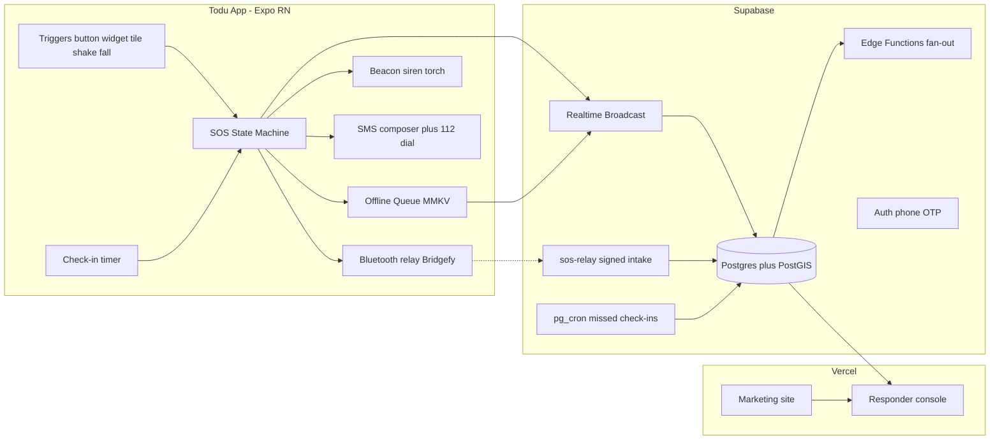
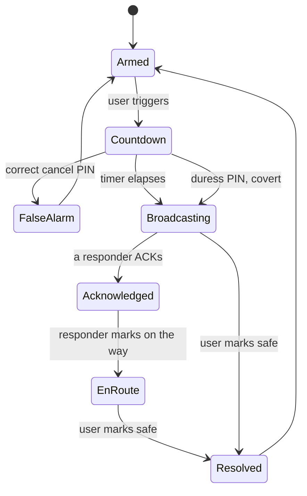
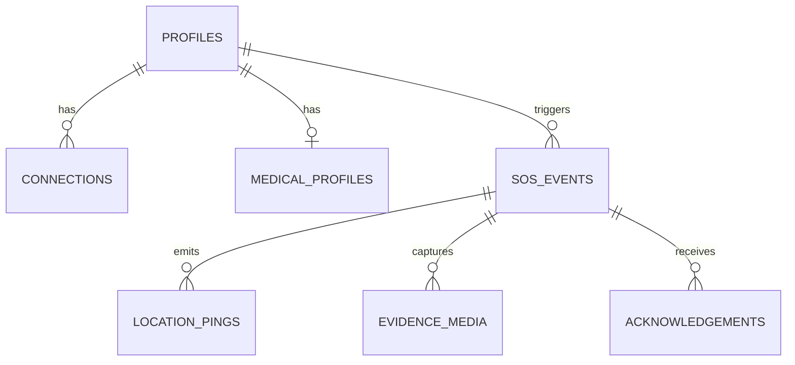
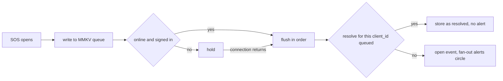

# Architecture

## Components

## Where the logic lives

| Concern | File |
|---|---|
| SOS lifecycle | `mobile/lib/sos-machine.ts` (pure, unit tested) |
| Effects dispatcher, SOS screen | `mobile/app/index.tsx` |
| Fallback ladder | `mobile/lib/ladder.ts` |
| Siren and vibration | `mobile/lib/beacon.ts` |
| Store and forward | `mobile/lib/queue-core.ts` (tested), `mobile/lib/queue.ts` |
| Live location trail | `mobile/lib/tracking.ts`, registered in `mobile/index.ts` |
| Server calls, OTP sign-in | `mobile/lib/backend.ts` |
| PIN rules, phone parsing | `mobile/lib/pin-rules.ts`, `mobile/lib/phone.ts` (tested) |
| Row level security | `supabase/migrations/0003_rls.sql`, `0005_security_fixes.sql` (tested) |
| Responder read model | `supabase/migrations/0004_responder_view.sql` |
| Console UI | `web/components/console.tsx` |
| Web data access | `web/lib/data.ts` |
| Bluetooth relay payload and signing | `mobile/lib/relay-core.ts` (tested), `mobile/lib/relay.ts`, `supabase/functions/sos-relay` |
| Alert fan-out, push and SMS | `supabase/functions/_shared/fanout.ts` (tested), `supabase/functions/sos-fanout` |
| Check-in timer | `mobile/lib/checkin.ts`, `supabase/migrations/0007_check_ins.sql` |
| Who is coming | `mobile/lib/responders.ts` (tested), `event_responders()` in 0005 |
| Incident timeline | `mobile/lib/incident-core.ts` (tested), `mobile/lib/incident.ts` |
| Shake and fall detection | `mobile/lib/motion-core.ts` (tested) |
| Torch beacon in Morse | `mobile/lib/torch.ts`, `mobile/components/torch-host.tsx` |
| Evidence photos | `uploadEvidence` in `mobile/lib/backend.ts`, `supabase/migrations/0008_evidence_storage.sql` |

## State machine

Two rules the tests pin down:

- A **wrong** PIN does not stand the alert down. Only the exact cancel PIN
  cancels; a panicked wrong guess must never silence an emergency.
- The **duress** PIN renders a convincing cancel while escalating covertly.
  The `covert` flag rides on the context so the UI can lie and the ladder cannot.

## Data model

Row level security is the enforcement boundary, not the application. An event
is readable by its owner and by profiles with an **active** connection to that
owner, expressed once in `is_connected_to()` and reused by every policy.

Live location uses Realtime **Broadcast**, not `postgres_changes`: pings arrive
several times a minute per active event and must not go through the WAL.
`location_pings` is the durable trail for the post-incident timeline.

## Offline queue rules

Every server write the SOS path makes goes through one serialised queue on
the phone (`mobile/lib/queue-core.ts`), written to MMKV before any network
wait. Four rules keep a flaky connection from causing harm:

- **One event, however many copies.** The phone mints a `client_id` when
  the countdown ends. The app, its queue and every Bluetooth relay upsert on
  it, so a retried or relayed alert never becomes a second event.
- **Pings and resolves carry that `client_id`.** A queued ping or "I am
  safe" lands on its own event, never on whatever alert happens to be
  current when the queue flushes. Before this rule, a resolve queued offline
  for one alert could close a later, live one.
- **An alert already over arrives as history.** If a resolve for the same
  `client_id` is waiting behind the event, the event is written as resolved
  and `sos-fanout` skips it, so nobody is woken for an emergency that ended
  while the phone was offline.
- **Check-in state is retried too.** Checking in offline keeps the wish to
  clear the server deadline and sends it when a connection returns, so
  pg_cron does not alert the circle about someone who is fine.

